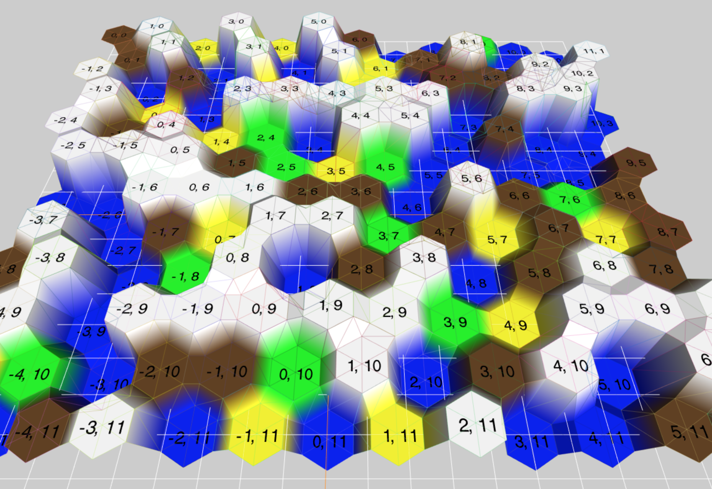

# Hexagonal Map Generator

A web-based tool that randomly generates terrain organized into a hexagonal grid.

**Built with Three.js**

## Requirements
To run this project, install the following software on your machine:
- [Node.js](https://nodejs.org/en/)

## Notable Tools
- [Parcel.js](https://parceljs.org/) - Javscript bundler & local dev server
- [Three.js](https://threejs.org/) - web-based 3D javascript engine

## Setup
1. `npm install`
2. `npm run dev`
3. Visit `localhost:1234` in your browser
